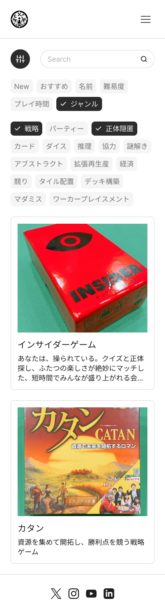
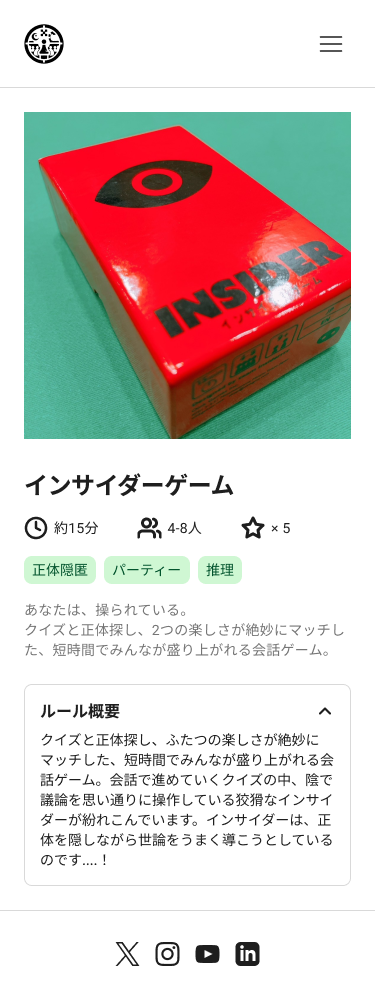

## ワイヤーフレーム/モックアップ

**ボードゲーム紹介ページ**

figmaを使って作成した。以下URLで公開中

https://www.figma.com/design/jTxMkfaFK1hHcd50tlhsWy/BoardGame?node-id=0-1&t=pKWlx1HbE69JoPsy-1

ボードゲームリストページ | ボードゲーム詳細ページ
--|--
 | 

### 基本レイアウト

* ヘッダー
    * サイトタイトル（例：我が家ボドゲカフェ）
    * 検索バー（ゲームタイトル、ジャンルなどで検索可能）
    * ユーザープロフィールアイコン（今後のフェーズで実装予定）

* メインコンテンツエリア
    * ボードゲーム一覧表示エリア
        * グリッドレイアウトまたはリストレイアウトで表示
        * 各ゲームにサムネイル画像、タイトル、ジャンルを表示

    * ボードゲーム詳細表示エリア
        * ゲーム画像（拡大表示可能）
        * タイトル
        * ジャンル
        * 説明文
        * ルール概要
        * プレイ人数
        * プレイ時間
        * 対象年齢
        * 難易度
        * おすすめ度
        * その他の情報（必要に応じて追加）

* フッター
    * サイトに関する情報（コピーライト、連絡先など）
    * SNSリンク（必要に応じて追加）

### レスポンシブデザイン

* デスクトップ、タブレット、スマートフォンなど、様々な画面サイズに対応したレイアウトを検討する。
* 各デバイスに最適な表示方法や操作性を考慮する。

### その他

* ユーザビリティを考慮したデザインにする。
* アクセシビリティガイドラインに準拠した設計にする。
* 必要に応じて、ページネーションやフィルタリング機能などを追加する。

**注釈:**

* これはあくまで初期段階のワイヤーフレーム/モックアップであり、開発を進める中で変更される可能性あり。
* 具体的なデザインや配色については、今後の設計フェーズで決定。