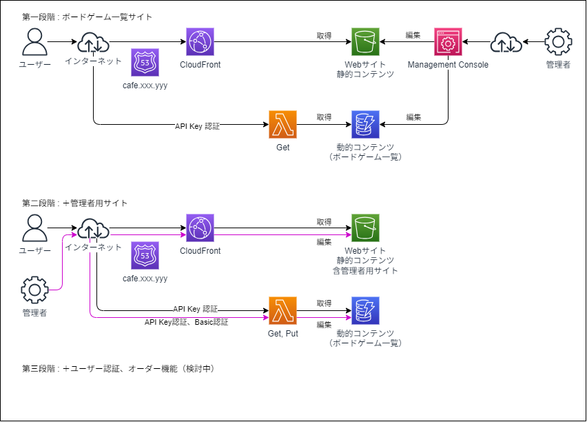

# 我が家ボドゲカフェ計画

AWS（Lambda、API Gateway、DynamoDB、S3）、React、Terraformを使用したフルスタックWeb開発のスキルを示すポートフォリオプロジェクトです。  
このウェブサイトはボードゲームカタログを提供し、友人とのボードゲーム会の体験を向上させることを目指しています。

## 機能（フェーズ1）

* ボードゲームカタログ：ゲーム画像、説明、ルール、プレイ人数、プレイ時間、対象年齢、難易度を含む、様々なボードゲームの詳細情報を閲覧できます。
* レスポンシブデザイン：デスクトップからスマートフォンまで、様々なデバイスでシームレスな体験を楽しめます。

## 今後の計画（検討中）

* ユーザー認証：安全なユーザー登録とログイン機能を実装します。
* 飲み物注文：遊びに来てくれている友人が飲み物を閲覧・注文できるようにします。
* イベントスケジューリング：友人らがボードゲームの集まりのためのイベントを作成・管理できるようにします。
* コミュニティ機能：ユーザー間のコミュニケーションと交流を促進するためのフォーラムまたはチャット機能を追加します。
* フィードバックシステム：ウェブサイトとその機能を改善するためのユーザーフィードバックを収集します。

## 技術スタック

* フロントエンド：React
* バックエンド：Python 3（AWS Lambdaを使用したサーバーレスアーキテクチャ）
* データベース：AWS DynamoDB
* ストレージ：AWS S3
* Infrastructure as Code：Terraform
* デプロイ：AWS CloudFront、API Gateway、Route 53

### 構成

現在想定している構成概略

## プロジェクト構造

* `01.企画`: プロジェクト計画書
* `02.要件定義`: 要件定義書
* `03.詳細設計`: 詳細設計書
* `04.技術選定`: 技術選定書
* `05.開発環境構築`: 開発環境構築手順
* `06.開発・テスト`: ソースコードとテストスクリプト
* `07.デプロイ・公開`: デプロイ手順
* `08.運用・保守`: メンテナンスとトラブルシューティングガイド

## はじめ方（準備中）

0. ボードゲームを遊んでくれる友人を用意する
1. リポジトリをクローンする: `git clone https://github.com/qavion/home-board-game-website.git`
2. 依存関係をインストールする: 詳細な手順は `04.開発環境構築` ディレクトリを参照してください。（準備中）
3. AWSインフラストラクチャをセットアップする: Terraformを使用して必要なAWSリソースをプロビジョニングします。（準備中）
4. 開発サーバーを実行する: 手順は `05.開発・テスト` ディレクトリを参照してください。（準備中）
5. 友人にウェブサイトを共有する
6. 素敵な Game Night を！

## コントリビューティング（準備中）

コントリビューションは歓迎します！このプロジェクトへの貢献方法については、[CONTRIBUTING.md](CONTRIBUTING.md) ファイルをお読みください。（準備中）

## ライセンス

このプロジェクトはMITライセンスの下でライセンスされています - 詳細については、[LICENSE](LICENSE) ファイルを参照してください。

## 連絡先（準備中）

ご質問やご提案がある場合は、お気軽にご連絡ください。
